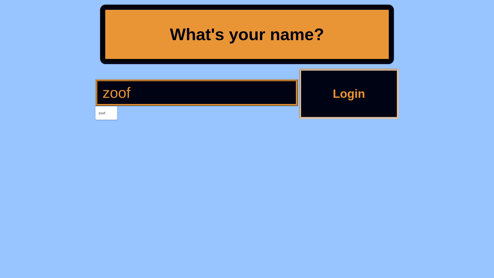
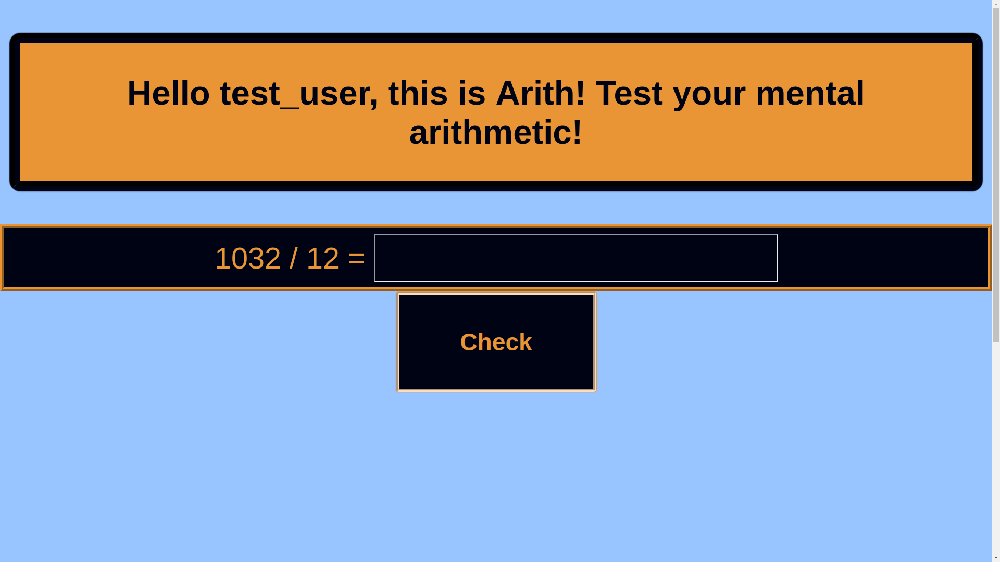
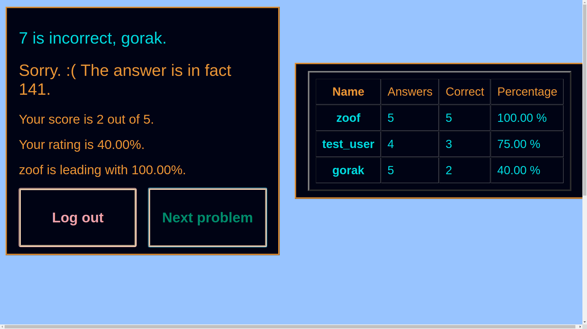

# Arith

## UX

The project comprises a simple app that gets users practising their mental arithmetic in competition with others.

There is these days much talk of "brain training" and more generally the benefit of keeping cerebral neurons as busy as possible.   Mental arithmetic is a great exercise for the brain and with the added feature of being in competition, even if informal, it can be a relaxing and entertaining activity to while away a few minutes between meetings, on the bus, in breaks between spells of physical work etc.

Of course a user can cheat in many ways from pen and paper to Google, but I'm unaware of any research showing benefits for cheating...

## Features

The user is initially greeted by a simple login page where s/he enters her/his name and clicks a Login button or presses `Enter`.


S/he is then taken to a page with an arithmetical sum to be solved.   The user enters the answer in a box and clicks "Check" or presses `Enter`.



They are then taken to a page where they are congratulated or commiserated with, depending on whether their answer was correct.   Personal statistics are shown and the leaderboard is displayed to the user, showing all users who have been logged on to the current server instance along with their scores and percentage ratings.   The user is informed of the name/s of the leader/s, determined by percentage correct out of questions answered.


At this point the user may click the "Next Problem" button, and this button is very slightly scaled up in size in order to subtly encourage the user do do just that.

They also have, though, a choice to click the "Logout" button, at which point they will be returned to the Login Page, their session user token destroyed and another user is free to log in.

Overall the interface is completely intuitive and the user should need no guidance about how to play.

### Features Left to Implement

- A logo

- A header and footer with my social media links, website and contact details.

- Display each sum on a face of a cube seen in 3d and in perspective.   Transition to a new sum by rotation to another face.   I think this is all doable in CSS without any Javascript.   I have made a rotating cube with text on so should be able to integrate this into the current app but for now I am keeping it simple as that is part of its attraction.

- Possibly set the user against the clock as an option. This would need Javascript to track client time.

## Technologies Used

- [Python](https://www.python.org/) for all backend code;
- [Flask](http://flask.pocoo.org/) for routing and views;
- [Heroku](https://devcenter.heroku.com/) for deployment and testing;
- [Jinja](http://jinja.pocoo.org/) for templating;
- [Sublime Text](https://www.sublimetext.com/) for coding.


## Specification

This application is designed to fulfil the requirements of the third milestone project of the Code Institute Full Stack Developer course 2018.

It is a simple game in which the user practises her/his mental arithmetic by attempting to calculate sums, differences, products and quotients of positive integers.  Multiple users should be catered for, and the app must keep track of how many questions each user has attempted, and how many have been answered correctly.   It should pass this data to HTML templates which are styled with CSS and thus displayed to each user in the browser.

In accordance with project guidelines, there is no persistence of data.   All information is held in volatile memory.   Similarly, there is no security or user validation.

The application uses Flask for routing and templating, and will be deployed to Heroku.   All logic is implemented in Python on the server.   Javascript on the client machine is used only for callbacks on text input etc.

We define one class: User, representing the user, storing name, number of problems attempted, number correct.   The app should calculate and display the user's score and percentage rating as well as the name and percentage score of the leading player.

The app will store an identifying userid and also the user's latest answer as a browser session object on the client machine.

The app will use the native random function to generate operands and operator to form a sum to be computed, e.g. ("28 x 13 = ? ")

We define a range for the operands (2 to n), fixed at present to (2, 100).

We use an <input> element on the page for the user to type in their answer.  They will then be congratulated or commiserated with and subsequently will proceed to attempting to answer the next randomly-generated arithmetic problem.   Their score and relative standing will be updated.

## Design, Development

- First, I conceived the basic idea of randomly generated arithmetical problems as seeming to fulfil the project requirements.

- Next, I coded the basic functionality and templates incrementally, until sufficient core functionality and views were implemented and appeared to be working OK.   As I am not as experienced or as fluent in Python as in Java or Javascript, I was constantly on [Stack Overflow](www.stackoverflow.com), <https://www.tutorialspoint.com/flask/flask_quick_guide.htm> and other such sites looking for Pythonic and Flaskian ways of doing things!

- Small changes were contained in separate commits with informative explanatory messages as far as I could manage in order to maintain a clear and detailed version control history at the [Github repo]()

- Then, prior to styling and testing , I deployed the app to Heroku as documented hereunder.

I did not have a clear idea of how I wanted the app to look, so I just started styling, writing small chunks of CSS and checking the results, sometimes, altering styles in the Chromium Dev Tools.   After exploring different ideas I came to a visual format I was happy with, being easy to use and uncluttered. 

- I then continued to develop the functionality and the styling in small increments encapsulated in separate commits.

## Testing

- Python was fairly new to me.   Flask Heroku, WSGI, Werkzeug and Jinja etc. wer completely new to me apart from running through the example projects in the course videos.   So with so much to learn I found it difficult to integrate testing into my development process and adopt a TDD approach.

- The upshot is that I did not write any unit tests nor any other automated tests.

- However, I did test the functionality and the logic repeatedly by hand, by mental calculation, by checking that routes were working as intended and that views displayed were correct and as intended.   And given the simplicity of the logic and of the user interface, there is really very little to test.

- I also tested on two laptops, an Android phone and an Android tablet.

- I have not yet tested on Windows, on IE, on Edge or on a Mac/iPhone/Safari setup.

- At each stage I tried to break the application.  

- Then, following Matt Rudge's Code Institute lectures...

Created byotest.py:

```
def f(object):
	return 0

def test_equal(actual, expected):
	assert expected  == actual, f'Expected {expected}, actual value returned was {actual}.'

test_equal(f(0),0)
```

Added another method:

```
def test_is_in(object, collection):
	assert object in collection, f'Expected {object} to be in {collection}, but it is not.'
```
Tested this with 

I am thinking about what I can test for and how I can cover as much of my code as possible with tests, ideally 100%.

### Things to test for

- The login functionality works: a `userid` session object is created and the user is taken to problems.html
- The logout functionality works: a `userid` session object is destroyed and the user is taken to index.html
- For any user, the user object should be in the list of users
- If the user's answer is equal to the correct answer, the user's score should increase by one

### Expanded byotest.py to:

```
# Beginnings of Python/Flask testing framework
# John Lynch
# January 2019

def f(object):
	return 0

arr = [2, 3, 5, 7, 11, 13, 17, 19]

# ~~~~~~~~~~~~~~~~~~~~~~~~~~~~~~~~~

def test_equal(actual, expected):
	assert expected  == actual, f'Expected {expected}, actual value returned was {actual}.'

def test_is_in(object, collection):
	assert object in collection, f'Expected {object} to be in {collection}, but it is not.'

def test_exists_as_session_object(obj):
	assert session.get("obj", False), f'{obj} is not currently saved as a session object.'

# ~~~~~~~~~~~~~~~~~~~~~~~~~~~~~~~~~

test_equal(f(0),0)	# should pass

test_equal(f(1),1)	# should fail

test_is_in(7, arr)	# should pass

test_is_in(256, arr)	# should fail

test_exists_as_session_object(x) # should fail

session["x"] = 0

test_exists_as_session_object(x) # should pass

# 3 tests should fail out of 7
```
```
18:44 /arith: 2445$ git add testing.log byotest.py 
18:45 /arith: 2446$ git commit -m "Begin to create testing framework with byotest.py"
[master c8cde94] Begin to create testing framework with byotest.py
 2 files changed, 21 insertions(+)
 create mode 100644 byotest.py
 create mode 100644 testing.log
18:45 /arith: 2447$ python3 byotest.py 
19:09 /arith: 2448$ python3 byotest.py 
Traceback (most recent call last):
  File "byotest.py", line 14, in <module>
    test_is_in(8, arr)
  File "byotest.py", line 10, in test_is_in
    assert object in collection, f'Expected {object} to be in {collection}, but it is not.'
AssertionError: Expected 8 to be in [2, 3, 5, 7, 11, 13, 17, 19], but it is not.
19:09 /arith: 2448$ python3 byotest.py 
Traceback (most recent call last):
  File "byotest.py", line 5, in <module>
    obj = {name: "Bob", age: 30}
NameError: name 'name' is not defined
19:23 /arith: 2448$ python3 byotest.py 
Traceback (most recent call last):
  File "byotest.py", line 25, in <module>
    test_equal(f(1),1)	# should fail
  File "byotest.py", line 13, in test_equal
    assert expected  == actual, f'Expected {expected}, actual value returned was {actual}.'
AssertionError: Expected 1, actual value returned was 0.
19:31 /arith: 2448$ python3 byotest.py 
Traceback (most recent call last):
  File "byotest.py", line 29, in <module>
    test_is_in(256, arr)	# should fail
  File "byotest.py", line 16, in test_is_in
    assert object in collection, f'Expected {object} to be in {collection}, but it is not.'
AssertionError: Expected 256 to be in [2, 3, 5, 7, 11, 13, 17, 19], but it is not.
19:32 /arith: 2448$ python3 byotest.py 
Traceback (most recent call last):
  File "byotest.py", line 29, in <module>
    test_is_in(256, arr)	# should fail
  File "byotest.py", line 16, in test_is_in
    assert object in collection, f'Expected {object} to be in {collection}, but it is not.'
AssertionError: Expected 256 to be in [2, 3, 5, 7, 11, 13, 17, 19], but it is not.
19:32 /arith: 2448$ python3 byotest.py 
Traceback (most recent call last):
  File "byotest.py", line 31, in <module>
    test_exists_as_session_object(x) # should fail
NameError: name 'x' is not defined
19:32 /arith: 2448$ python3 byotest.py 
Traceback (most recent call last):
  File "byotest.py", line 32, in <module>
    test_exists_as_session_object(x) # should fail
  File "byotest.py", line 19, in test_exists_as_session_object
    assert session.get("obj", False), f'{obj} is not currently saved as a session object.'
NameError: name 'session' is not defined
19:33 /arith: 2448$ python3 byotest.py 
Traceback (most recent call last):
  File "byotest.py", line 5, in <module>
    from Flask import session
ModuleNotFoundError: No module named 'Flask'
19:34 /arith: 2448$ python3 byotest.py 
Traceback (most recent call last):
  File "byotest.py", line 34, in <module>
    test_exists_as_session_object(x) # should fail
  File "byotest.py", line 21, in test_exists_as_session_object
    assert session.get("obj", False), f'{obj} is not currently saved as a session object.'
  File "/usr/local/lib/python3.6/dist-packages/werkzeug/local.py", line 347, in __getattr__
    return getattr(self._get_current_object(), name)
  File "/usr/local/lib/python3.6/dist-packages/werkzeug/local.py", line 306, in _get_current_object
    return self.__local()
  File "/usr/local/lib/python3.6/dist-packages/flask/globals.py", line 37, in _lookup_req_object
    raise RuntimeError(_request_ctx_err_msg)
RuntimeError: Working outside of request context.

This typically means that you attempted to use functionality that needed
an active HTTP request.  Consult the documentation on testing for
information about how to avoid this problem.
```
So, I need a request object to use a session object.   Wel, we'll forget about that for now.

I can see how to write tests with assertions to test at least some of my code, but I need to understand how to modularise the testing...

Listening again to Matt Rudge's lectures...

It appears that the approach recommended is to import the test file into the main Python app and add calls to the test functions directly for testing purposes.   This does not seem ideal to me but I will go with it for now.

Added test at bottom of run.py:

`test_is_in("anon", users)`

Result of running `run.py`:
`AssertionError: Expected anon to be in [], but it is not.
` 

Eventually came to using `test_is_in("test_user", (u.name for u in users))
`

to test that a user had been added and that the test would fail for a user that was not in the users list:

First a different username was entered and the test failed.
Then "test_user" was entered and the test passed.

This shows that loggin in adds a user to the list of users.

I could attempt to cover more of the code but I am finding it hard to find sufficient documentation about creating a context which to test and easily supplying data to that dummy context in Flask.

I realise I have not done enough to fully satisfy the testing requirements but at this stage I feel I have done enough to show that I understand the basics of testing by creating a basic testing framework and implementing one substantive test.

And I have done more than sufficient manual testing on four different devices to convince myself that the app works as intended.

So I intend to submit it as is.

- At the time of writing I still have an issue with responsiveness, i.e. I seem to have a partial failure of my media query for small phones, so on such devices I would like the login box, for instance, to extend the full width of the screen (though the user is free to pinch-zoom).   I have not yet been able fully to debug this.

## Deployment to Heroku

I created an app on Heroku and then set Heroku as a remote for my local repo in addition to the existing Github remote, and pushed my code to it, as shown in the log:

```
 21:16 /arith: 2052$ heroku git:remote -a arith
set git remote heroku to https://git.heroku.com/arith.git
21:21 /arith: 2053$ git remote -v
heroku	https://git.heroku.com/arith.git (fetch)
heroku	https://git.heroku.com/arith.git (push)
origin	git@github.com:teraspora/arith.git (fetch)
origin	git@github.com:teraspora/arith.git (push)
21:28 /arith: 2054$ git push -u heroku master 
Counting objects: 88, done.
Delta compression using up to 4 threads.
Compressing objects: 100% (85/85), done.
Writing objects: 100% (88/88), 11.85 KiB | 674.00 KiB/s, done.
Total 88 (delta 40), reused 0 (delta 0)
remote: Compressing source files... done.
remote: Building source:
remote: 
remote: -----> Python app detected
remote: -----> Installing python-3.6.7
remote: -----> Installing pip
remote: -----> Installing SQLite3
remote: -----> Installing requirements with pip
remote:        Collecting click==6.7 (from -r /tmp/build_85788446f1f796621fa0efa7f8fb0f13/requirements.txt (line 1))
remote:          Downloading https://files.pythonhosted.org/packages/34/c1/8806f99713ddb993c5366c362b2f908f18269f8d792aff1abfd700775a77/click-6.7-py2.py3-none-any.whl (71kB)
remote:        Collecting Flask==1.0.2 (from -r /tmp/build_85788446f1f796621fa0efa7f8fb0f13/requirements.txt (line 2))
remote:          Downloading https://files.pythonhosted.org/packages/7f/e7/08578774ed4536d3242b14dacb4696386634607af824ea997202cd0edb4b/Flask-1.0.2-py2.py3-none-any.whl (91kB)
remote:        Collecting itsdangerous==0.24 (from -r /tmp/build_85788446f1f796621fa0efa7f8fb0f13/requirements.txt (line 3))
remote:          Downloading https://files.pythonhosted.org/packages/dc/b4/a60bcdba945c00f6d608d8975131ab3f25b22f2bcfe1dab221165194b2d4/itsdangerous-0.24.tar.gz (46kB)
remote:        Collecting Jinja2==2.10 (from -r /tmp/build_85788446f1f796621fa0efa7f8fb0f13/requirements.txt (line 4))
remote:          Downloading https://files.pythonhosted.org/packages/7f/ff/ae64bacdfc95f27a016a7bed8e8686763ba4d277a78ca76f32659220a731/Jinja2-2.10-py2.py3-none-any.whl (126kB)
remote:        Collecting MarkupSafe==1.0 (from -r /tmp/build_85788446f1f796621fa0efa7f8fb0f13/requirements.txt (line 5))
remote:          Downloading https://files.pythonhosted.org/packages/4d/de/32d741db316d8fdb7680822dd37001ef7a448255de9699ab4bfcbdf4172b/MarkupSafe-1.0.tar.gz
remote:        Collecting numpy==1.15.0 (from -r /tmp/build_85788446f1f796621fa0efa7f8fb0f13/requirements.txt (line 6))
remote:          Downloading https://files.pythonhosted.org/packages/88/29/f4c845648ed23264e986cdc5fbab5f8eace1be5e62144ef69ccc7189461d/numpy-1.15.0-cp36-cp36m-manylinux1_x86_64.whl (13.9MB)
remote:        Collecting pandas==0.23.3 (from -r /tmp/build_85788446f1f796621fa0efa7f8fb0f13/requirements.txt (line 7))
remote:          Downloading https://files.pythonhosted.org/packages/f4/cb/a801eaf624e36fffaa6cf1f4597a1e4b0742c200ed928e689c58fb3cb811/pandas-0.23.3-cp36-cp36m-manylinux1_x86_64.whl (8.9MB)
remote:        Collecting python-dateutil==2.7.3 (from -r /tmp/build_85788446f1f796621fa0efa7f8fb0f13/requirements.txt (line 8))
remote:          Downloading https://files.pythonhosted.org/packages/cf/f5/af2b09c957ace60dcfac112b669c45c8c97e32f94aa8b56da4c6d1682825/python_dateutil-2.7.3-py2.py3-none-any.whl (211kB)
remote:        Collecting pytz==2018.5 (from -r /tmp/build_85788446f1f796621fa0efa7f8fb0f13/requirements.txt (line 9))
remote:          Downloading https://files.pythonhosted.org/packages/30/4e/27c34b62430286c6d59177a0842ed90dc789ce5d1ed740887653b898779a/pytz-2018.5-py2.py3-none-any.whl (510kB)
remote:        Collecting Werkzeug==0.14.1 (from -r /tmp/build_85788446f1f796621fa0efa7f8fb0f13/requirements.txt (line 10))
remote:          Downloading https://files.pythonhosted.org/packages/20/c4/12e3e56473e52375aa29c4764e70d1b8f3efa6682bef8d0aae04fe335243/Werkzeug-0.14.1-py2.py3-none-any.whl (322kB)
remote:        Collecting six>=1.5 (from python-dateutil==2.7.3->-r /tmp/build_85788446f1f796621fa0efa7f8fb0f13/requirements.txt (line 8))
remote:          Downloading https://files.pythonhosted.org/packages/73/fb/00a976f728d0d1fecfe898238ce23f502a721c0ac0ecfedb80e0d88c64e9/six-1.12.0-py2.py3-none-any.whl
remote:        Installing collected packages: click, itsdangerous, MarkupSafe, Jinja2, Werkzeug, Flask, numpy, pytz, six, python-dateutil, pandas
remote:          Running setup.py install for itsdangerous: started
remote:            Running setup.py install for itsdangerous: finished with status 'done'
remote:          Running setup.py install for MarkupSafe: started
remote:            Running setup.py install for MarkupSafe: finished with status 'done'
remote:        Successfully installed Flask-1.0.2 Jinja2-2.10 MarkupSafe-1.0 Werkzeug-0.14.1 click-6.7 itsdangerous-0.24 numpy-1.15.0 pandas-0.23.3 python-dateutil-2.7.3 pytz-2018.5 six-1.12.0
remote: 
remote: -----> Discovering process types
remote:        Procfile declares types -> web
remote: 
remote: -----> Compressing...
remote:        Done: 72M
remote: -----> Launching...
remote:        Released v3
remote:        https://arith.herokuapp.com/ deployed to Heroku
remote: 
remote: Verifying deploy... done.
To https://git.heroku.com/arith.git
 * [new branch]      master -> master
Branch 'master' set up to track remote branch 'master' from 'heroku'.

```
So, I tried to open the app in a browser.   Result: "Application Error" message from Heroku - page couldn't be served.   Log:

```
21:58 /arith: 2060$ heroku logs --tail
2019-01-16T20:58:37.029049+00:00 app[api]: Enable Logplex by user johnlynch.32768@gmail.com
2019-01-16T21:25:12.056244+00:00 heroku[router]: at=info code=H81 desc="Blank app" method=GET path="/" host=arith.herokuapp.com request_id=9688a23f-e7a9-4813-b613-5df67c40b916 fwd="80.233.31.148" dyno= connect= service= status=502 bytes= protocol=https
2019-01-16T21:32:22.727543+00:00 app[api]: Release v3 created by user johnlynch.32768@gmail.com
2019-01-16T21:32:22.747918+00:00 app[api]: Scaled to web@1:Free by user johnlynch.32768@gmail.com
2019-01-16T21:32:32.804352+00:00 app[web.1]: * Debugger is active!
2019-01-16T21:32:32.805443+00:00 app[web.1]: * Debugger PIN: 960-713-823
2019-01-16T21:32:36.000000+00:00 app[api]: Build succeeded
2019-01-16T21:33:30.715437+00:00 heroku[web.1]: Error R10 (Boot timeout) -> Web process failed to bind to $PORT within 60 seconds of launch
2019-01-16T21:33:30.715437+00:00 heroku[web.1]: Stopping process with SIGKILL
2019-01-16T21:33:30.785251+00:00 heroku[web.1]: Process exited with status 137
2019-01-16T21:33:30.881992+00:00 heroku[web.1]: State changed from crashed to starting
2019-01-16T21:33:36.542720+00:00 heroku[web.1]: Starting process with command `python3 run.py`
2019-01-16T21:33:38.407562+00:00 app[web.1]: * Serving Flask app "run" (lazy loading)
2019-01-16T21:33:38.407583+00:00 app[web.1]: * Environment: production
2019-01-16T21:33:38.407629+00:00 app[web.1]: WARNING: Do not use the development server in a production environment.
2019-01-16T21:33:38.407669+00:00 app[web.1]: Use a production WSGI server instead.
2019-01-16T21:33:38.407697+00:00 app[web.1]: * Debug mode: on
2019-01-16T21:33:38.425706+00:00 app[web.1]: * Running on http://127.0.0.1:12162/ (Press CTRL+C to quit)
2019-01-16T21:33:38.426543+00:00 app[web.1]: * Restarting with stat
2019-01-16T21:33:38.749701+00:00 app[web.1]: * Debugger is active!
2019-01-16T21:33:38.751246+00:00 app[web.1]: * Debugger PIN: 310-516-164
2019-01-16T21:34:36.926578+00:00 heroku[web.1]: Error R10 (Boot timeout) -> Web process failed to bind to $PORT within 60 seconds of launch
2019-01-16T21:34:36.926654+00:00 heroku[web.1]: Stopping process with SIGKILL
2019-01-16T21:34:37.003507+00:00 heroku[web.1]: Process exited with status 137
2019-01-16T21:53:52.987682+00:00 heroku[web.1]: State changed from crashed to starting
2019-01-16T21:53:57.561585+00:00 heroku[web.1]: Starting process with command `python3 run.py`
2019-01-16T21:54:58.096583+00:00 heroku[web.1]: State changed from starting to crashed
2019-01-16T21:54:57.977555+00:00 heroku[web.1]: Error R10 (Boot timeout) -> Web process failed to bind to $PORT within 60 seconds of launch
2019-01-16T21:54:57.977719+00:00 heroku[web.1]: Stopping process with SIGKILL
2019-01-16T21:54:58.079550+00:00 heroku[web.1]: Process exited with status 137
2019-01-16T21:57:43.000000+00:00 app[api]: Build started by user johnlynch.32768@gmail.com
2019-01-16T21:58:06.116939+00:00 app[api]: Deploy 17aecc4f by user johnlynch.32768@gmail.com
2019-01-16T21:58:06.116939+00:00 app[api]: Release v4 created by user johnlynch.32768@gmail.com
2019-01-16T21:58:07.402778+00:00 heroku[web.1]: State changed from crashed to starting
2019-01-16T21:58:15.446732+00:00 app[web.1]: * Serving Flask app "run" (lazy loading)
2019-01-16T21:58:15.446754+00:00 app[web.1]: * Environment: production
2019-01-16T21:58:15.446800+00:00 app[web.1]: WARNING: Do not use the development server in a production environment.
2019-01-16T21:58:15.446870+00:00 app[web.1]: Use a production WSGI server instead.
2019-01-16T21:58:15.446917+00:00 app[web.1]: * Debug mode: on
2019-01-16T21:58:15.525680+00:00 app[web.1]: * Running on http://127.0.0.1:35684/ (Press CTRL+C to quit)
2019-01-16T21:58:15.530464+00:00 app[web.1]: * Restarting with stat
2019-01-16T21:58:15.795617+00:00 app[web.1]: * Debugger is active!
2019-01-16T21:58:15.796647+00:00 app[web.1]: * Debugger PIN: 254-766-664
2019-01-16T21:58:19.000000+00:00 app[api]: Build succeeded
2019-01-16T21:59:13.659184+00:00 heroku[web.1]: State changed from starting to crashed
2019-01-16T21:59:17.123915+00:00 heroku[router]: at=error code=H10 desc="App crashed" method=GET path="/" host=arith.herokuapp.com request_id=e2f52003-b11f-4a47-8364-a6afb3c67e7a fwd="80.233.31.148" dyno= connect= service= status=503 bytes= protocol=https
```
Tried again, and "Method Not Allowed" displayed.

I think I need to set the port and IP address, adjust the app.run() statement.

Consulted my notes.

```
22:24 /arith: 2061$ heroku ps:scale web=1
Scaling dynos... done, now running web at 1:Free

```
Updated run.py to get IP & PORT.

App then basically working, served from Heroku.

For security, I altered run.py to set debug=False and used `os.getenv()` to get a Flask `app.secret_key`

The main repo is hosted at https://github.com/teraspora/arith and the app is deployed to https://arith.herokuapp.com.

## Acknowledgements

My thanks to all the great teachers who provide tutorials and lessons in a variety of formats for free.   Such a valuable cornucopia of resources to help us manipulate bits.